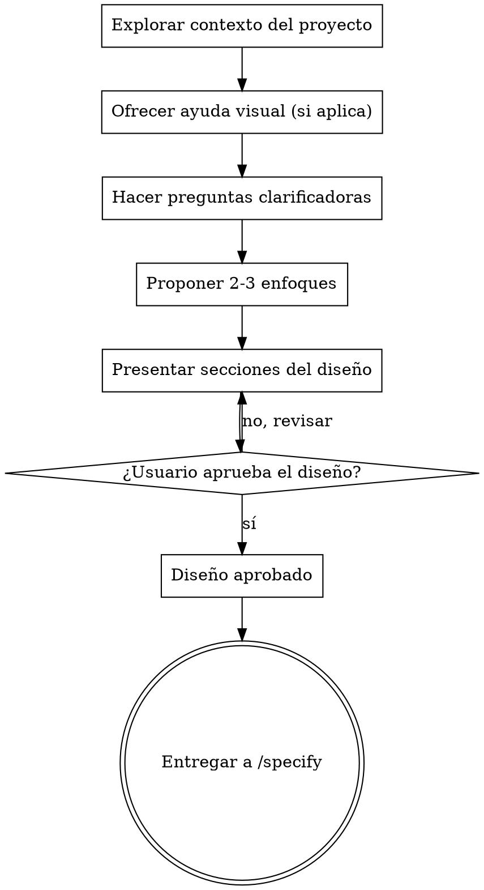

# Brainstorming: de idea a diseño aprobado

Convierte una idea en un diseño claro y acordado mediante diálogo colaborativo.

Explora primero el contexto del proyecto, luego haz preguntas una a la vez para refinar la idea. Cuando entiendas qué se va a construir, presenta el diseño y consigue la aprobación del usuario. Escribir el spec formal y la implementación quedan fuera de alcance — esta skill termina cuando el diseño es aprobado. El siguiente paso natural es la skill `specify`, que convierte el diseño aprobado en `requirements.md` y `design.md`; entrégaselo una vez que el usuario apruebe (ver **Siguiente paso: entregar a `/specify`** más abajo).

<HARD-GATE>
No escribas código, no hagas scaffolding de ningún proyecto, ni tomes ninguna acción de implementación hasta haber presentado un diseño y que el usuario lo haya aprobado. Esto aplica a TODO proyecto sin importar qué tan simple parezca.
</HARD-GATE>

## Anti-patrón: "Esto es demasiado simple para necesitar un diseño"

Todo proyecto pasa por este proceso. Una lista de tareas, una función utilitaria, un cambio de configuración — todos. Los proyectos "simples" son donde las suposiciones no examinadas causan más trabajo desperdiciado. El diseño puede ser corto (unas pocas frases para proyectos realmente simples), pero DEBES presentarlo y conseguir aprobación.

## Checklist

Completa esto en orden:

1. **Explorar el contexto del proyecto** — revisar archivos, docs, commits recientes
2. **Ofrecer ayuda visual solo si realmente aporta** — justo a tiempo, no de entrada (ver sección **Ayuda visual** más abajo)
3. **Hacer preguntas clarificadoras** — una a la vez, entender propósito/restricciones/criterios de éxito
4. **Proponer 2-3 enfoques** — con trade-offs y tu recomendación
5. **Presentar el diseño** — en secciones escaladas a su complejidad, conseguir aprobación del usuario después de cada sección
6. **Detenerse en la aprobación** — una vez que el usuario aprueba el diseño, el brainstorming terminó
7. **Entregar a `/specify`** — recomendar correr la skill `specify` para formalizar el diseño aprobado en `requirements.md` y `design.md` antes de cualquier implementación

## Flujo del proceso

## El proceso

**Entendiendo la idea:**

- Revisa primero el estado actual del proyecto (archivos, docs, commits recientes)
- Antes de hacer preguntas detalladas, evalúa el alcance: si la petición describe múltiples subsistemas independientes (ej. "quiero una plataforma con chat, almacenamiento de archivos, facturación y analítica"), señálalo de inmediato. No gastes preguntas refinando detalles de un proyecto que primero necesita descomponerse.
- Respeta "una feature a la vez": si la idea agrupa varias features, ayuda al usuario a elegir una sola para hacer brainstorming ahora y deja el resto para después.
- Para ideas con alcance apropiado, haz preguntas una a la vez para refinar la idea
- Prefiere preguntas de opción múltiple cuando sea posible, pero abiertas también está bien
- Una sola pregunta por mensaje — si un tema necesita más exploración, divídelo en varias preguntas
- Enfócate en entender: propósito, restricciones, criterios de éxito

**Explorando enfoques:**

- Propón 2-3 enfoques distintos con sus trade-offs
- Presenta las opciones de forma conversacional con tu recomendación y el razonamiento
- Empieza con la opción que recomiendas y explica por qué

**Presentando el diseño:**

- Una vez que creas entender qué se va a construir, presenta el diseño
- Escala cada sección a su complejidad: unas pocas frases si es directo, hasta 200-300 palabras si es más matizado
- Pregunta después de cada sección si va bien encaminado
- Cubre: arquitectura, componentes, flujo de datos, manejo de errores, testing
- Está listo para regresar y aclarar si algo no tiene sentido

**Diseñando para aislamiento y claridad:**

- Divide el sistema en unidades más pequeñas, cada una con un propósito claro, que se comuniquen mediante interfaces bien definidas y puedan entenderse y probarse de forma independiente
- Para cada unidad, deberías poder responder: ¿qué hace?, ¿cómo se usa?, ¿de qué depende?
- ¿Alguien puede entender qué hace una unidad sin leer su interior? ¿Puedes cambiar el interior sin romper a quien la consume? Si no, los límites necesitan trabajo.

**Trabajando en código existente:**

- Explora la estructura actual antes de proponer cambios. Sigue los patrones existentes.
- Cuando el código existente tenga problemas que afecten el trabajo (ej. un archivo que creció demasiado, límites poco claros, responsabilidades enredadas), incluye mejoras puntuales como parte del diseño.
- No propongas refactors sin relación. Mantente enfocado en lo que sirve al objetivo actual.
- No agregues dependencias sin una necesidad clara.

## Ayuda visual (diagramas simples)

A veces una pregunta se entiende mejor mostrada que descrita — por ejemplo, un flujo de estados, la forma de un modelo de datos, o cómo se relacionan varios componentes. Para eso no hace falta ningún servidor ni herramienta externa: basta con un diagrama en texto plano dentro del propio mensaje.

- **Ofrécelo justo a tiempo, no de entrada.** No anuncies esta capacidad al inicio del brainstorming. La primera vez que una pregunta concreta se beneficiaría de verse en vez de leerse, ofrece un diagrama ahí mismo (ej. "¿te ayuda si dibujo cómo fluyen los datos entre estos componentes?").
- **Usa Mermaid o ASCII art** directamente en el mensaje — un diagrama de flujo, de secuencia, o un esquema de tablas/entidades. No se requiere aprobación previa ni herramienta externa; es solo otra forma de responder.
- **No fuerces el formato visual.** Preguntas conceptuales o de alcance ("¿qué significa 'categoría' en este contexto?") se responden mejor en texto. Reserva el diagrama para relaciones, flujos o estructuras que realmente son más claras dibujadas.
- Si nunca surge una pregunta que se beneficie de esto, no ofrezcas nada — no es un paso obligatorio, es una herramienta disponible cuando aporta.

## Principios clave

- **Una pregunta a la vez** — no abrumar con múltiples preguntas
- **Opción múltiple preferida** — más fácil de responder que las abiertas cuando es posible
- **Una feature a la vez** — hacer brainstorming de una sola feature; dejar de lado otros frentes en paralelo
- **YAGNI sin piedad** — eliminar features innecesarias de todos los diseños
- **Explorar alternativas** — siempre proponer 2-3 enfoques antes de decidir
- **Validación incremental** — presentar diseño, conseguir aprobación antes de avanzar
- **Ser flexible** — regresar y aclarar cuando algo no tenga sentido

## Siguiente paso: entregar a `/specify`

El brainstorming produce una *dirección acordada*, no el spec formal. En el momento en que el usuario aprueba el diseño, cierra el ciclo señalando la siguiente etapa del workflow del proyecto (`brainstorming → specify → planning-tasks → ejecución → verificación → commit`): la skill `specify`, que redacta el diseño aprobado como `requirements.md` (criterios EARS) y `design.md`.

Haz esto en vez de deslizarte directo a la implementación — la misma razón por la que existe el HARD-GATE: un spec escrito y revisable detecta suposiciones equivocadas mientras todavía son baratas de corregir.

- **Recomiéndalo explícitamente.** Una vez aprobado el diseño, di algo como: "El diseño está aprobado. El siguiente paso es formalizarlo con la skill `specify` (genera `requirements.md` y `design.md`). ¿Lo lanzo?"
- **Lleva el contexto contigo.** El diseño aprobado ya cubre arquitectura, componentes, flujo de datos, manejo de errores y testing — pásaselo a `specify` para que no vuelva a interrogar sobre lo que ya está decidido; debe reutilizar esas decisiones y enfocarse en convertir el comportamiento en criterios EARS numerados.
- **No la invoques en silencio.** Deja que el usuario confirme antes de arrancar `specify`, ya que abre una nueva fase (con su propia puerta de aprobación de requirements).
