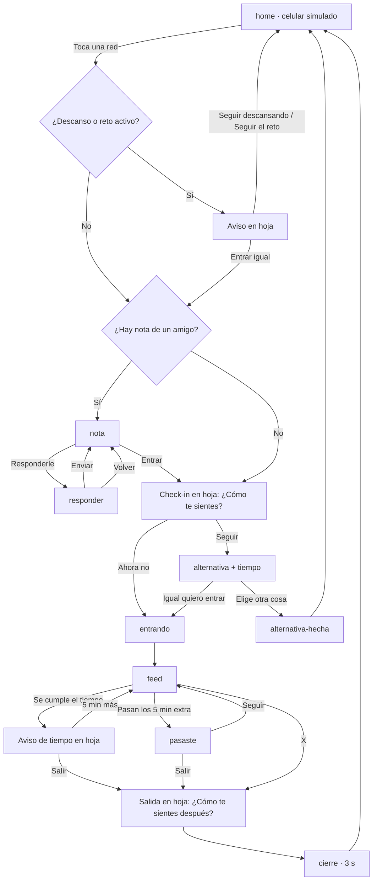

# PILAS · Pantallas de la app
> v0.2 · Grupo 7 · Usa los tokens y componentes de `design-system.md`. El estado, las reglas técnicas y las decisiones están en `spec-tecnico.md`.

**Tarea principal (prototipo vertical):** abrir una red social con intención y salir sin culpa.
**Usuario:** Sami, 17 años, Bogotá. Entra a redes en automático en pausas de estudio y antes de dormir.

Cada pantalla se llama igual que su `data-screen` en `index.html`. Las hojas inferiores no son pantallas: viven en `#sheet-layer`.

Leyenda: 🟣 construido en el prototipo · ⚪ contexto (no se programa) · 🟡 depende de validar con entrevistas.

---

## Flujo

Desde `home`, el ícono PILAS abre **Hoy**. Hoy, Grupo, Descanso y Yo se navegan con la barra inferior.

---

## Tarea principal 🟣

### home · Celular simulado
- **Objetivo:** demostrar la intercepción al abrir una red. En HTML no se puede interceptar una app real; en producción sería un Accessibility Service (Android) o Screen Time (iOS).
- **Contenido:** fecha y hora, un ícono por cada red con pausa encendida (Instagram, TikTok) y el ícono de PILAS.
- **Acciones:** tocar una red → flujo de entrada · tocar PILAS → Hoy.
- **Reglas:** sin apps decorativas ni logos reales.

### Aviso de descanso o reto (hoja)
- **Objetivo:** recordar, sin bloquear, que Sami está en un descanso o en un reto.
- **Copy:** "Estás en un descanso. ¿Sigues así?" · `Estás en el reto "…". ¿Sigues así?`
- **Acciones:** "Seguir descansando" o "Seguir el reto" (botón oscuro) → home · "Entrar igual" (texto plano) → sigue el flujo.
- **Reglas:** "Entrar igual" siempre visible y sin penalización. Tocar fuera equivale a seguir. Descanso tiene prioridad: nunca salen dos avisos seguidos.

### nota · Nota de un amigo
- **Objetivo:** que un amigo le deje algo a Sami antes de entrar, sin presión.
- **Contenido:** personaje, "‹Amigo› te dejó algo antes de entrar", el mensaje (puede traer un dibujo o una flor) y "‹Amigo› no ve si entras, cuánto tiempo ni cómo te sientes."
- **Mensajes de ejemplo:** "Ey ey, ¡pilas con el cel!" · "Te dibujé esto, no te rías." · "Te mandé esta flor para que te concentres."
- **Acciones:** "Responderle" (oscuro) → responder · "Entrar igual" (texto plano) → check-in.
- **Después de responder:** la misma nota muestra "Le respondiste a ‹Amigo›: …" y una sola acción, "Entrar a ‹red›".

### responder · Responder al amigo
- **Contenido:** el mensaje del amigo con su avatar, frases cortas ("¡Dale!", "¡Gracias!", "Jaja, listo") y muñequitos con carita: "Listo", "Lo pensaré", "Ahorita no puedo", "Te cuento luego".
- **Acciones:** "Enviar" (activo con una frase, un muñequito o ambos) → vuelve a la nota · "Volver" → nota.
- **Reglas:** responder nunca es obligatorio.

### Check-in (hoja) · ¿Cómo te sientes?
- **Objetivo:** que Sami nombre su emoción antes de entrar.
- **Contenido:** "¿Cómo te sientes?" · "Solo tú lo ves." · 4 tarjetas de color en 2 × 2: Calma, Alegría, Ansiedad, Aburrimiento.
- **Acciones:** "Seguir" (activo al elegir) → alternativa · "Ahora no" → entrando.
- **Reglas:** ninguna emoción es buena o mala. No se pregunta a qué va.

### alternativa · ¿Y si pruebas otra cosa primero?
- **Objetivo:** ofrecer una alternativa y preguntar el tiempo, sin prohibir.
- **Contenido:** fondo del color de la emoción; "¿Cuánto tiempo piensas usar la app?" con 5 min · 10 min · 15 min · Indefinido (10 min preseleccionado, o el de la última vez); "Prueba una de estas" con dos fichas cuadradas según la emoción (p. ej. "Escribirle a alguien", "Poner una canción", "Respirar 1 minuto").
- **Acciones:** una ficha → alternativa-hecha · "Igual quiero entrar" (texto plano) → entrando.
- **Reglas:** "Indefinido" entra sin aviso de tiempo. 🟡 Las alternativas deben salir de las entrevistas.

### alternativa-hecha
- **Contenido:** la alternativa elegida y "Cuando quieras, vuelves a tu celular."
- **Acciones:** "Volver al celular" (amarillo, con ícono de celular) → home.

### entrando
- **Contenido:** automática, 1 s: "Entrando a ‹red› · 10 min" (sin el tiempo si es indefinido).
- **Acciones:** ninguna → feed.

### feed
- **Contenido:** feed simulado con tarjetas de relleno y un botón X.
- **Acciones:** X → salida. Al cumplirse el tiempo elegido, sale el aviso de tiempo.

### Aviso de tiempo (hoja)
- **Copy:** "Ya van tus 10 min. ¿Cómo vas?"
- **Acciones:** "Salir" → salida · "5 min más" (o tocar fuera) → feed; si pasan, pasaste.
- **Reglas:** sin rojo, sin vibración, sin cuenta regresiva.

### pasaste
- **Copy:** "Llevas 10 min. Dijiste 5." · "Puedes salir o seguir. Tú decides."
- **Acciones:** "Salir" (oscuro) → salida · "Seguir" → feed (vuelve a avisar en 5 min).
- **Reglas:** informa sin castigo; "Seguir" siempre disponible.

### Salida (hoja) · ¿Cómo te sientes después?
- **Contenido:** las mismas 4 emociones, en tarjetas de color, y "Saltar".
- **Acciones:** elegir o "Saltar" → guarda la entrada → cierre.

### cierre
- **Objetivo:** cerrar el ciclo con un mensaje corto; se va sola a home a los 3 s.
- **Contenido:** todo centrado, con el color de la emoción de salida.
  - Calma o Alegría: "Cuando te pones las pilas, tienes el control."
  - Ansiedad o Aburrimiento: "Tranqui, tú tienes el control." · "Busca algo que te anime."
  - Sin emoción: "Es tu decisión, sigue así."
- **Si llevó rato** (se pasó o 20 min o más): tarjeta de PILAS en lugar del personaje: "PILAS: llevas un buen rato en redes. Un descanso te puede caer bien."

---

## Secciones de la app 🟣

### Hoy (inicio)
- **Contenido:** saludo con la hora del día · Reto de hoy (única tarjeta con `shadow-pilas`) · vista previa de Tu grupo · "Crea un foco" (lleva a Descanso con 2 min) · "Déjale algo a un amigo" · "Volver al inicio" (amarillo, vuelve al celular) · "Reiniciar prototipo".
- **No incluir:** total de horas, rachas, comparaciones, lista de entradas.

### Grupo
- **Contenido:** lista de amigos con un chip "En curso" o "✓ Cumplió" (ninguno si no está en un reto) · Los premiados de hoy (2, sin puntos ni ranking) · 2 retos activos con "Le entro" / "Estás en el reto" + "Salir del reto" · "Proponer un reto".
- **Reglas:** no se ve el tiempo de uso de nadie más. El tiempo propio es privado y opcional.

### Descanso
- **Contenido:** tiempo sugerido (20 min) · chips 2 · 10 · 20 · 30 min · "Empezar descanso" · "Tus logros" con barras y porcentajes simulados.
- **Reglas:** si sale antes no pasa nada.

### descanso-activo y descanso-fin
- **descanso-activo:** "Descansando ‹N› min" · "No pasa nada si sales antes." · "Ir al celular" (amarillo) · "Salir antes". Al cumplirse el tiempo pasa solo a descanso-fin.
- **descanso-fin:** "Terminó tu descanso" · "Volviste cuando quisiste." · "Listo" → Hoy.

### dejarmensaje · Déjale algo a un amigo
- **Contenido:** ¿A quién? (amigos) · mensajes sugeridos ("Ey ey, ¡pilas con el cel!", "¿Cómo vas hoy?", "Acuérdate de tomar agua") · campo para escribir el propio.
- **Acciones:** "Enviar mensaje" (activo con amigo y mensaje) → Hoy con confirmación · "Volver" → Hoy sin guardar.
- **Reglas:** quien envía no ve si ni cuándo el otro abre una red.

### Yo
- **Contenido:** horas de foco del mes · metas (con "Agregar meta") · Redes con pausa (Instagram y TikTok, encendidas) · Lo que lograste este mes · Ajustes: Pausa antes de abrir redes, Compartir mi tiempo con el grupo, Cambiar personaje (próximamente).
- **Reglas:** describe, no califica; solo Sami lo ve. Con "Pausa antes de abrir redes" apagado, abrir una red entra directo.

---

## Contexto ⚪

- **Onboarding** (bienvenida, cómo funciona, elige tus redes, tus momentos): no se programa.
- **Registro semanal** y **ajustes completos** (Privacidad, Ley 1581 de 2012, Borrar mis datos): no se programan. 🟡 Validar si ver patrones semanales se siente útil o como vigilancia.
- **Modo pausa de estudio / Pomodoro** 🟡: depende de confirmar en entrevistas que es un rasgo real del usuario.

## Preguntas abiertas para el grupo

1. ¿Qué alternativas reales mencionaron los entrevistados para "¿Y si pruebas otra cosa primero?"
2. ¿Qué emociones salieron del diagrama de afinidades? Hoy son 4 provisionales.
3. ¿El botón oscuro de "Seguir el reto" y el texto plano de "Entrar igual" cuentan como patrón oscuro? Ver `docs/spec-tecnico.md` §9.
