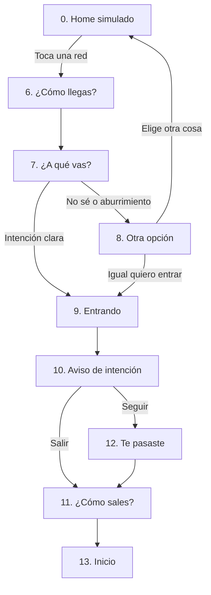

# PILAS · Pantallas de la app
> Borrador v0.1 · Grupo 7 · Usa los tokens y componentes de `design-system.md`. Lo que ya se construyó está en `spec.md`.

**Tarea principal (prototipo vertical):** abrir una red social con intención y salir sin culpa.
**Usuario:** Sami, 17 años, Bogotá. Entra a redes en automático en pausas de estudio y antes de dormir.

Leyenda de alcance:
- 🟣 **Prototipo vertical**: se construye funcional para la entrega.
- ⚪ **Contexto**: se diseña en wireframe, no se programa.
- 🟡 **Hipótesis**: depende de validar con entrevistas.

---

## Flujo general

---

## Onboarding ⚪

### 1. Bienvenida
- **Objetivo:** presentar PILAS en una frase.
- **Contenido:** personaje grande, nombre, `title-lg`.
- **Copy borrador:** "Ponte las pilas con tus redes. Sin bloquearlas."
- **Acciones:** Primario "Empezar" → 2.

### 2. Cómo funciona
- **Objetivo:** explicar el mecanismo antes de pedir permisos.
- **Contenido:** 3 pasos cortos con ilustración pequeña (una sola pantalla, no carrusel).
  1. Antes de abrir una red, te preguntamos cómo llegas.
  2. Decides a qué vas y cuánto tiempo.
  3. Sales cuando quieras. Sin castigos.
- **Acciones:** Primario "Entendido" → 3.

### 3. Elige tus redes
- **Objetivo:** que Sami decida qué apps acompaña PILAS.
- **Contenido:** lista con toggles, iconos genéricos (no logos reales).
- **Copy borrador:** "¿Con cuáles quieres ir con más calma?"
- **Acciones:** Primario "Guardar redes" → 4 · Secundario "Después".

### 4. Tus momentos
- **Objetivo:** conocer cuándo pierde el control (dato del desk research).
- **Contenido:** chips de selección múltiple: Al despertar · Antes de dormir · Estudiando · Cuando me aburro · Otro.
- **Copy borrador:** "¿Cuándo sientes que entras sin pensarlo?"
- **Acciones:** Primario "Guardar" → 5 · Secundario "Saltar".

### 5. Listo
- **Contenido:** personaje + "Listo. La próxima vez que abras una red, aquí estamos."
- **Acciones:** Primario "Ir al inicio" → 13.

---

## Tarea principal 🟣

### 0. Home simulado del celular
- **Objetivo:** simular el celular de Sami para disparar el flujo (en HTML no se puede interceptar apps reales).
- **Contenido:** fondo de pantalla, 6–8 iconos inventados, 2 de ellos marcados como redes.
- **Acciones:** tocar un icono de red → 6.
- **Nota:** usar iconos inventados, no logos de TikTok o Instagram.

### 6. ¿Cómo llegas?
- **Objetivo:** que Sami nombre su emoción antes de entrar (oportunidad de diseño del desk research).
- **Contenido:** `title-lg`, grilla de 2 columnas con tarjetas de emoción (componente 5.3).
- **Copy borrador:** "¿Cómo llegas?" · ayuda: "Solo tú lo ves."
- **Acciones:**
  - Seleccionar emoción → activa primario "Seguir" → 7.
  - Secundario "Ahora no" → entra directo a la red (9). No se bloquea.
- **Reglas:** ninguna emoción se marca como buena o mala. Sin contador.

### 7. ¿A qué vas?
- **Objetivo:** convertir la entrada automática en una decisión.
- **Contenido:**
  - Chips de intención (selección única): Hablar con alguien · Buscar algo puntual · Descansar un rato · No sé.
  - Chips de tiempo: 5 min · 10 min · 15 min · Sin tiempo.
- **Copy borrador:** "¿A qué vas?" · "¿Cuánto tiempo?"
- **Acciones:**
  - Primario "Entrar" → 9.
  - Si eligió "No sé" o la emoción es aburrimiento → 8.
- **Pendiente:** ¿"Sin tiempo" se permite? Decidir en grupo.

### 8. Otra opción (opcional)
- **Objetivo:** ofrecer una alternativa, no una prohibición.
- **Contenido:** fondo pleno del color de la emoción (componente 5.6), 2 o 3 alternativas cortas según la emoción.
  - Aburrimiento: "Escribirle a alguien" · "Poner una canción" · "Salir 5 min".
  - Ansiedad: "Respirar 1 minuto" · "Escribir qué te preocupa".
- **Copy borrador:** "¿Y si pruebas otra cosa primero?"
- **Acciones:**
  - Elegir alternativa → pantalla simple de la actividad → vuelve a 0.
  - Secundario "Igual quiero entrar" → 9 (mismo tamaño y visibilidad que las opciones).
- 🟡 Las alternativas deben salir de las entrevistas: qué hace Sami cuando no está en redes.

### 9. Entrando
- **Objetivo:** confirmar la intención y dar paso a la red.
- **Contenido:** transición de 1 s con la intención elegida.
- **Copy borrador:** "Vas a descansar un rato · 10 min"
- **Acciones:** automática → pantalla simulada de feed (imagen estática o scroll de placeholders).

### 10. Aviso de intención
- **Objetivo:** avisar sin interrumpir de golpe.
- **Contenido:** hoja inferior (no pantalla completa) sobre el feed simulado.
- **Copy borrador:** "Ya van tus 10 min. ¿Cómo vas?"
- **Acciones:**
  - Primario "Salir" → 11.
  - Secundario "5 min más" → vuelve al feed; al terminar → 12.
- **Reglas:** sin rojo, sin vibración fuerte, sin cuenta regresiva.

### 11. ¿Cómo sales?
- **Objetivo:** cerrar el ciclo emocional (¿funcionó como alivio o no?).
- **Contenido:** misma grilla de emociones que la pantalla 6, en versión compacta de chips.
- **Copy borrador:** "¿Cómo sales?"
- **Acciones:** seleccionar → mensaje breve → 13. Secundario "Saltar".
- **Mensaje de cierre:** "Saliste cuando quisiste." (si cumplió) · "Listo. Mañana es otro día." (si se pasó).

### 12. Te pasaste
- **Objetivo:** informar con honestidad, sin castigo.
- **Contenido:** dato simple, fondo `surface`, acento `state-fuera`.
- **Copy borrador:** "Llevas 25 min. Dijiste 10."
- **Acciones:** Primario "Salir" → 11 · Secundario "Seguir".
- **Regla:** "Seguir" siempre disponible. PILAS no bloquea.

---

## Pantallas secundarias ⚪

### 13. Inicio
- **Objetivo:** mostrar el día sin puntaje.
- **Contenido:**
  - Saludo con la hora del día ("Buenas noches, Sami").
  - Tarjeta protagonista (`shadow-pilas`): última entrada con emoción de llegada → emoción de salida.
  - Lista de entradas del día: red, intención, tiempo, emoción.
- **Navegación inferior:** Inicio · Registro · Ajustes. (⚠️ El design system define 4: Hoy · Emociones · Intenciones · Yo. El código usa los 4.)
- **No incluir:** total de horas grande, rachas, comparaciones con otros.

### 14. Registro
- **Objetivo:** que Sami vea patrones, no números.
- **Contenido:** semana en vista simple.
  - "Entras más cuando: [emoción más frecuente]"
  - "Tu momento más difícil: [momento más frecuente]"
  - "Veces que saliste cuando quisiste: X de Y"
- 🟡 Validar si a los adolescentes les sirve ver esto o lo sienten como vigilancia.

### 15. Ajustes
- **Contenido:** Mis redes · Mis momentos · Avisos (suave / ninguno) · Privacidad (qué datos se guardan, Ley 1581 de 2012) · Borrar mis datos.

### 16. Modo pausa de estudio 🟡
- **Objetivo:** acompañar el descanso del Pomodoro de Sami.
- **Contenido:** al iniciar un descanso, la intención y el tiempo vienen predefinidos (5 min).
- **Depende de:** confirmar en entrevistas que el Pomodoro es un rasgo real del usuario.

---

## Preguntas abiertas para el grupo

1. ~~¿El prototipo vertical cubre de 0 a 11, o solo de 0 a 9?~~ Construido de 0 a 13, incluidas 8 y 12.
2. ¿"Sin tiempo" en la pantalla 7 es válido o contradice el concepto? (hoy se permite)
3. ¿Qué alternativas reales mencionaron los entrevistados para la pantalla 8?
4. ¿Qué emociones salieron del diagrama de afinidades para la grilla de la pantalla 6?
5. ¿Navegación inferior de 3 destinos (pantallas) o de 4 (design system)?
